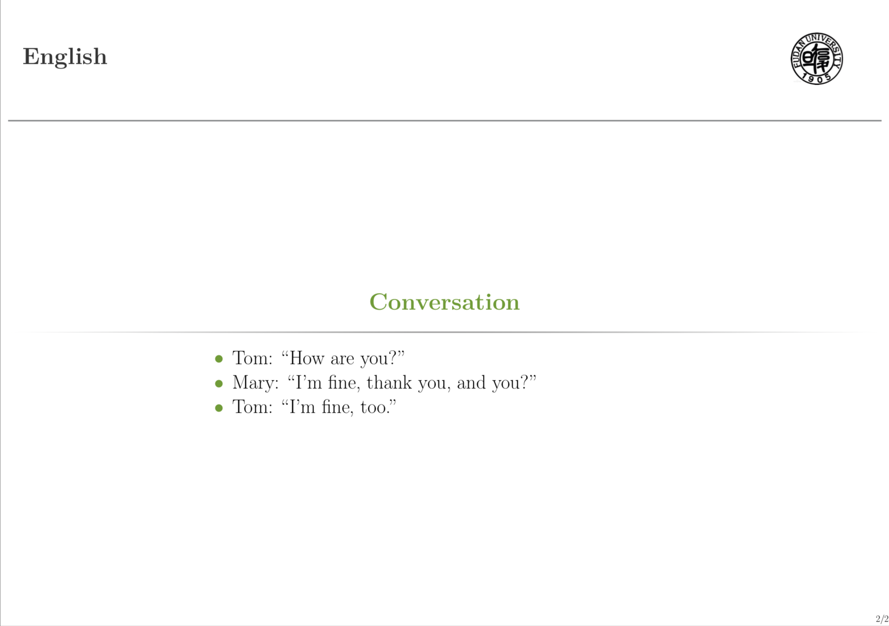

## latex beamer theme

只需要把 beamerthemeeasy.sty文件放到beamer所在文件夹就可以了, bg.pdf是学校/公司标识

    \documentclass[xetex,mathserif,serif]{beamer}
    \usetheme{easy}
    
[稍微详细一点的介绍-知乎](https://zhuanlan.zhihu.com/p/69315556 )
    
效果图:

